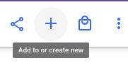
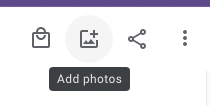

# Adding photos to an existing album
Follow these steps if you have already created an album and want to add more photos to it. There are a couple different ways to do this!

## Add by photo
1. Go to [https://photos.google.com/](https://photos.google.com/) and scroll to find the picture(s) you want to add 
2. Hover over the photo you want to add to an existing album, and then click the checkmark that appears in the corner of the photo
3. Do this for as many photos as you want to add
4. Click the plus sign in the top right corner of your screen, and select "Album"

    
5. Select the existing album you want these photos to be part of.

## Add from inside the album
1. Go to [https://photos.google.com/albums](https://photos.google.com/albums) and click the album you'd like to add photos to 
2. Click the Add Photos button in the top right corner of your screen

    
3. Find and select the photos you'd like to add.
4. Click "Done".

[Go Back](./index.md)
