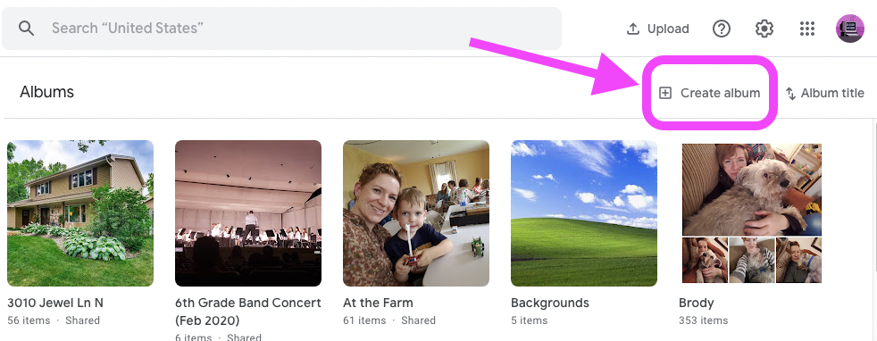
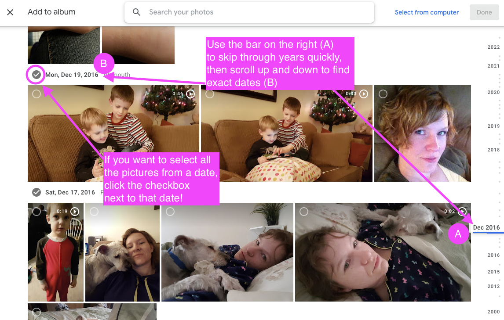
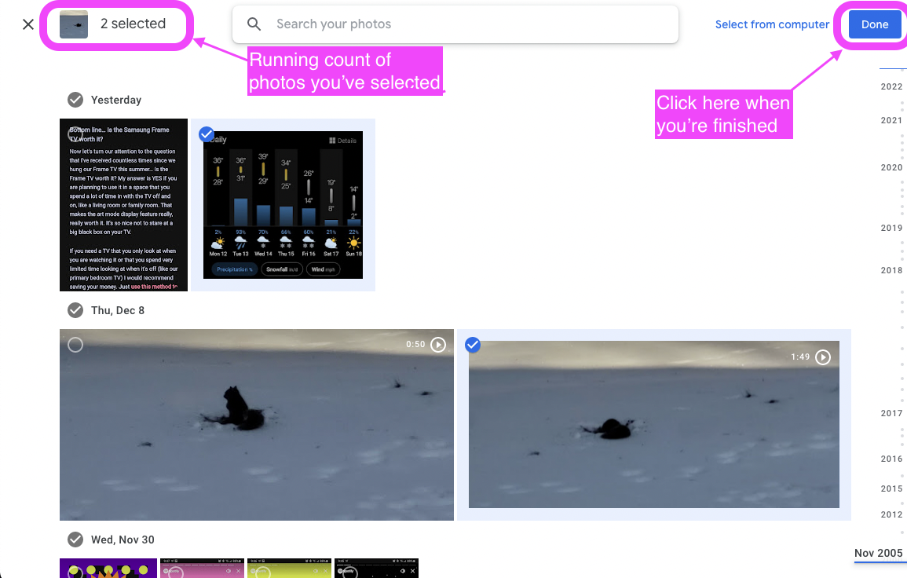
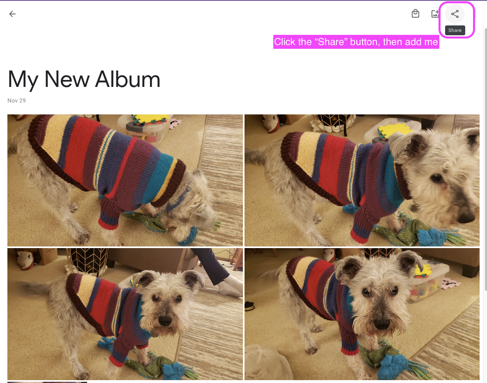
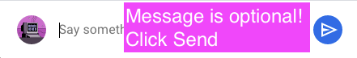

| Instruction | Example |
|-------------|-------------|
| 1. Go to [https://photos.google.com/albums](https://photos.google.com/albums) and click "Create Album" | 
| 2. Name the album (something like "Christmas Pictures") and then start scrolling down and selecting photos. |  --- 
| 3. Click "Done". The album is created! (If you missed any photos, you can still add them to this album later.) | 
| 4. Now click the "Share" button in the upper right corner, and click my name. You can add a message where it says "Say Something" but this is optional. |  --- 
| 5. Click the blue "Send" button.  | 
