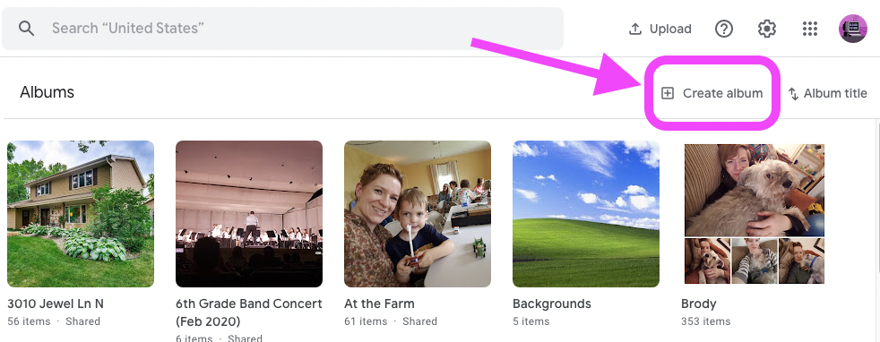
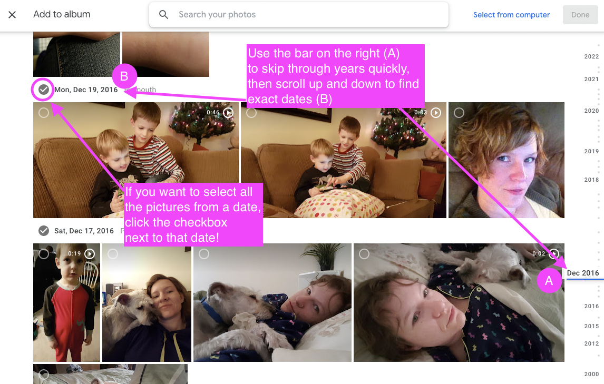
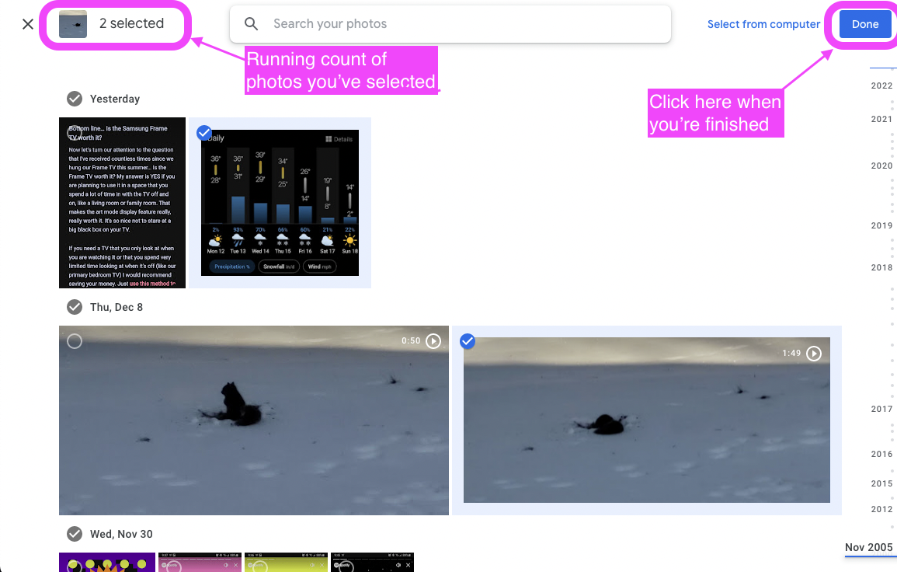
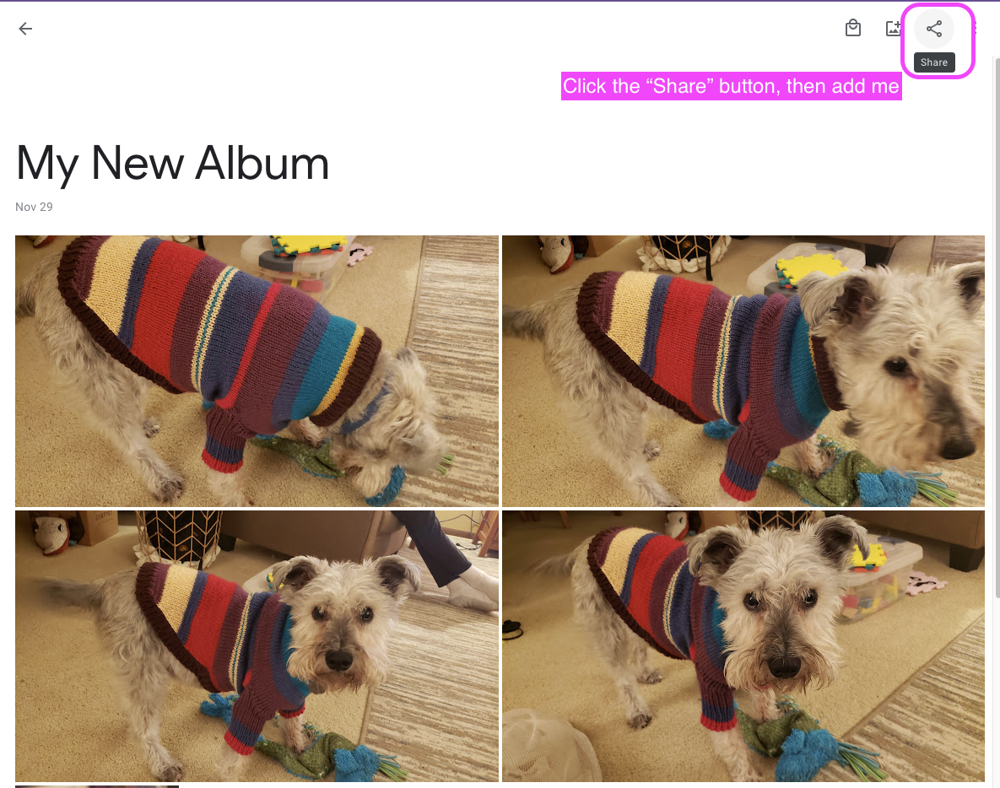

# Creating a new photo album

| Instruction | Example |
|-------------|-------------|
| 1. Go to [https://photos.google.com/albums](https://photos.google.com/albums) and click "Create Album" | 
| 2. Name the album (something like "Christmas Pictures") and then start scrolling down and selecting photos. | 
| 3. Click "Done". The album is created! (If you missed any photos, you can still add them to this album later.) | 
| 4. [optional] If you'd like to SHARE this album with someone, click the "Share" button in the upper right corner, and find the person's name. You can add a message where it says "Say Something" but this is optional. | 
| 5. [optional] Click the blue "Send" button.  | 

[Go Back](./index.md)