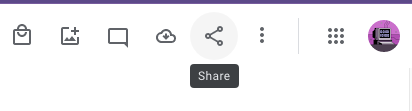

# Sharing an Existing Album

1. Go to [https://photos.google.com/albums](https://photos.google.com/albums) and click the album you'd like to share.
2. Click the "Share" button in the upper right corner, and find the person's name. You can add a message where it says "Say Something" but this is optional.

    
3. Click the blue "Send" button.

    

[Go Back](./index.md)